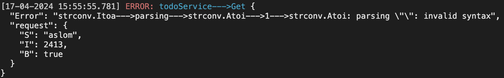
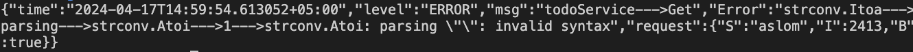

Here's a refactored version of your documentation for the `errs` package:

---

# Error Wrapping Utility [](https://ci.appveyor.com/project/davecheney/errors/branch/master) [](http://godoc.org/github.com/pkg/errors) [](https://goreportcard.com/report/github.com/pkg/errors)

## Package errors provides simple error handling primitives.

This utility package provides two functions, `Wrap` and `WrapLog`, designed to enhance error handling and logging in Go applications.

---

### Installation

```
go get github.com/sulton0011/errs
```

---

## Function `Wrap`

The `Wrap` function wraps an existing error with additional messages, creating more informative error messages by combining custom messages with the original error message. This facilitates improved context and error tracing.

### Usage

```go
Wrap(&originalErr, "Additional message 1", "Additional message 2")
```

If `originalErr` is not nil, `Wrap` creates a new error that includes the provided additional messages along with the original error message.

---

## Function `WrapLog`

The `WrapLog` function combines error wrapping with logging, useful for debugging and monitoring purposes. It logs the wrapped error along with request-related information and custom messages.

### Usage

```go
WrapLog(&originalErr, requestInfo, "Additional log message")
```

If `originalErr` is not nil, `WrapLog` logs a message that combines the additional log message, request information, and the original error message.

---

## Benefits

- **Enhanced Error Information**: Easily add contextual information to error messages, making it easier to identify the source of errors.
- **Simplified Debugging**: Detailed error messages and logging information reduce the time to identify and fix issues.
- **Effective Monitoring**: Create informative log entries for error situations, aiding in real-time monitoring and issue detection.
- **Readable and Maintainable Code**: Encapsulate error wrapping and logging logic for cleaner and easier-to-maintain code.

---

## Caution

- Be mindful of excessive messages, as they might clutter logs and make debugging more difficult.
- Use relevant, concise, and helpful messages to ensure meaningful context in combined error messages.

---

## Examples

### Example 1

```go
func main() {
	err = errs.New(`strconv.Atoi: parsing "": invalid syntax`)
	err = errs.Wrap(&err, `strconv.Atoi`, 1)
	err = errs.Wrap(&err, `strconv.Itoa`, "parsing")

	errs.WrapLog(&err, request, "todoService", "Get")

	time.Sleep(time.Second)
}
```

In this example, `WrapLog` logs the error with additional information, while `Wrap` combines the error with a custom error message for better error handling.

### Output



---

## The log can be controlled via errs.UpdateLevel

### Example 2

```go
func main() {
	var level = errs.LevelDebug // or errs.LevelError 

	errs.UpdateLevel(level)

	err = errs.New(`strconv.Atoi: parsing "": invalid syntax`)
	err = errs.Wrap(&err, `strconv.Atoi`, 1)
	err = errs.Wrap(&err, `strconv.Itoa`, "parsing")

	errs.WrapLog(&err, request, "todoService", "Get")

	time.Sleep(time.Second)
}
```

### Output


---

### Example 3

```go
func main() {

	var level = errs.LevelWarn // or errs.LevelInfo

	errs.UpdateLevel(level)

	err = errs.New(`strconv.Atoi: parsing "": invalid syntax`)
	err = errs.Wrap(&err, `strconv.Atoi`, 1)
	err = errs.Wrap(&err, `strconv.Itoa`, "parsing")

	errs.WrapLog(&err, request, "todoService", "Get")

	time.Sleep(time.Second)
}
```

### Output



---

This refactored documentation provides a clearer structure and flow, making it easier for readers to understand and use the `errs` package.